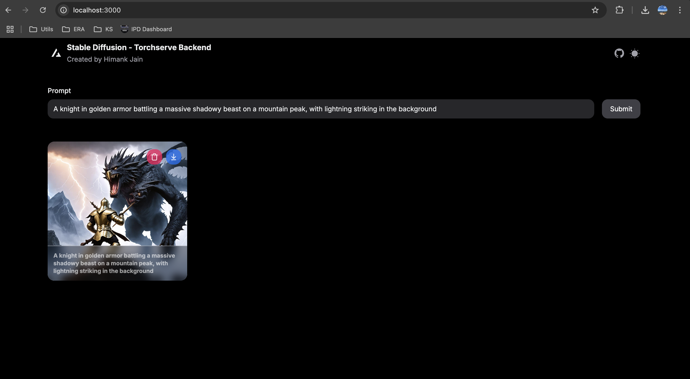

# Stable Diffusion 3 (SD3) Image Generation Platform

## Table of Contents
- [Objective](#objective)
- [Demo](#demo)
- [Components](#components)
  - [TorchServe](#torchserve)
  - [FastAPI](#fastapi)
  - [Next.js Frontend](#nextjs-frontend)
  - [AWS S3](#aws-s3)
- [Why TorchServe?](#why-torchserve)
- [Architecture Overview](#architecture-overview)

## Objective

The **Stable Diffusion 3 (SD3) Image Generation Platform** is designed to provide a seamless and efficient system for generating high-quality images from textual prompts. Leveraging advanced machine learning models, the platform integrates multiple technologies to offer a robust solution for text-to-image generation tasks. The primary goals of this project are:

- **Efficiency:** Utilize optimized serving mechanisms to handle inference requests swiftly.
- **Scalability:** Ensure the system can scale horizontally to manage increasing workloads.
- **User-Friendly Interface:** Provide an intuitive frontend for users to interact with the image generation service.
- **Reliability:** Ensure consistent performance and availability through robust backend services and infrastructure.

---

## Demo

### Inference

### Backend Logs

 

---

## Components

The SD3 platform is composed of four main components:

### TorchServe

[TorchServe](https://github.com/pytorch/serve) is a flexible and easy-to-use tool for serving PyTorch models. It simplifies the process of deploying machine learning models at scale, providing features like multi-model serving, model versioning, and advanced logging.

**Key Features:**
- **Scalability:** Automatically scales to handle concurrent requests.
- **Multi-Model Serving:** Supports deploying and managing multiple models simultaneously.
- **Monitoring:** Provides metrics and logs for monitoring model performance.
- **Extensibility:** Allows custom handlers for specialized preprocessing or postprocessing.

### FastAPI

[FastAPI](https://fastapi.tiangolo.com/) is a modern, fast (high-performance) web framework for building APIs with Python 3.7+ based on standard Python type hints. It is used in the SD3 platform to handle API requests, manage background tasks, and interact with TorchServe and AWS S3.

**Key Features:**
- **High Performance:** Comparable to Node.js and Go in terms of speed.
- **Ease of Use:** Intuitive and developer-friendly, with automatic interactive documentation.
- **Asynchronous Support:** Built-in support for asynchronous programming.
- **Dependency Injection:** Simplifies the management of dependencies.

### Next.js Frontend

[Next.js](https://nextjs.org/) is a React framework that enables server-side rendering and generating static websites for React-based web applications. In the SD3 platform, Next.js serves as the frontend, providing users with an interactive interface to submit text prompts and view generated images.

**Key Features:**
- **Server-Side Rendering (SSR):** Enhances performance and SEO.
- **Static Site Generation (SSG):** Pre-renders pages for faster load times.
- **API Routes:** Allows building API endpoints within the frontend project.
- **Rich Ecosystem:** Supports a wide range of plugins and integrations.

### AWS S3

[Amazon S3 (Simple Storage Service)](https://aws.amazon.com/s3/) is an object storage service that offers industry-leading scalability, data availability, security, and performance. In the SD3 platform, AWS S3 is used to store and retrieve generated images, ensuring durability and easy access.

**Key Features:**
- **Scalability:** Seamlessly scales to handle large amounts of data.
- **Durability:** Provides 99.999999999% durability.
- **Security:** Offers robust security features, including encryption and access control.
- **Integration:** Easily integrates with other AWS services and third-party tools.

## Why TorchServe?

Choosing TorchServe as the model serving solution for the SD3 platform offers several advantages:

1. **Optimized for PyTorch Models:**
   - TorchServe is specifically designed for PyTorch, ensuring seamless integration and efficient serving of PyTorch-based models like Stable Diffusion 3.

2. **Ease of Deployment:**
   - Simplifies the deployment process with built-in support for model versioning, multi-model serving, and configuration management.

3. **Scalability and Performance:**
   - Automatically scales to handle varying loads, making it suitable for production environments with high concurrent requests.

4. **Custom Handlers:**
   - Allows the implementation of custom preprocessing and postprocessing logic, enabling tailored workflows for specific use cases.

5. **Monitoring and Metrics:**
   - Provides comprehensive monitoring and logging capabilities, facilitating the tracking of model performance and system health.

6. **Active Community and Support:**
   - Backed by the PyTorch community, ensuring continuous improvements, updates, and support.

By leveraging TorchServe, the SD3 platform ensures reliable, scalable, and efficient serving of the Stable Diffusion 3 model, providing a robust backend for the image generation service.

## Architecture Overview

The SD3 platform follows a microservices architecture, encapsulating each component within its own service for modularity and scalability.

1. **Frontend (Next.js):**
   - Users interact with the application through a web interface built with Next.js.
   - Submits textual prompts to the FastAPI backend and displays generated images.

2. **Backend (FastAPI):**
   - Receives API requests from the frontend.
   - Handles background tasks to process image generation.
   - Communicates with TorchServe to perform inference.
   - Stores and retrieves generated images from AWS S3.

3. **Model Serving (TorchServe):**
   - Hosts the Stable Diffusion 3 model.
   - Processes inference requests and returns generated images to the backend.

4. **Storage (AWS S3):**
   - Stores generated images for persistent storage and retrieval.

